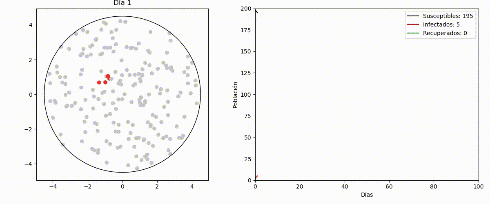
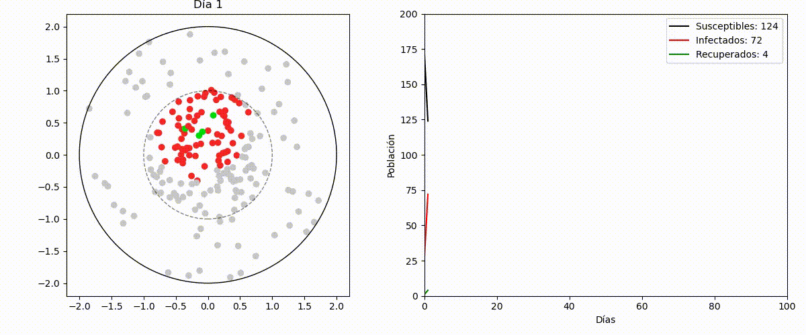

# Simulación del Modelo SIR

Este repositorio contiene una simulación del modelo SIR (Susceptible, Infectado, Recuperado) en diferentes configuraciones espaciales: circular y rectangular, con y sin clústeres.

## Estructura del Proyecto

- `Circulo.py`: Implementación del modelo SIR en una distribución circular uniforme.
- `Circulo_cluster.py`: Implementación del modelo SIR en una distribución circular con clústeres.
- `Rectangulo.py`: Implementación del modelo SIR en una distribución rectangular uniforme.
- `Rectangulo_Cluster.py`: Implementación del modelo SIR en una distribución rectangular con clústeres.

## Requisitos
- Python 3
- Bibliotecas: numpy, pandas, matplotlib

```sh
pip install numpy pandas matplotlib
```
## Ciudad Rectangular


## Ciudad Rectangular con cluster


## Ciudad Circular



## Ciudad Circular con cluster


